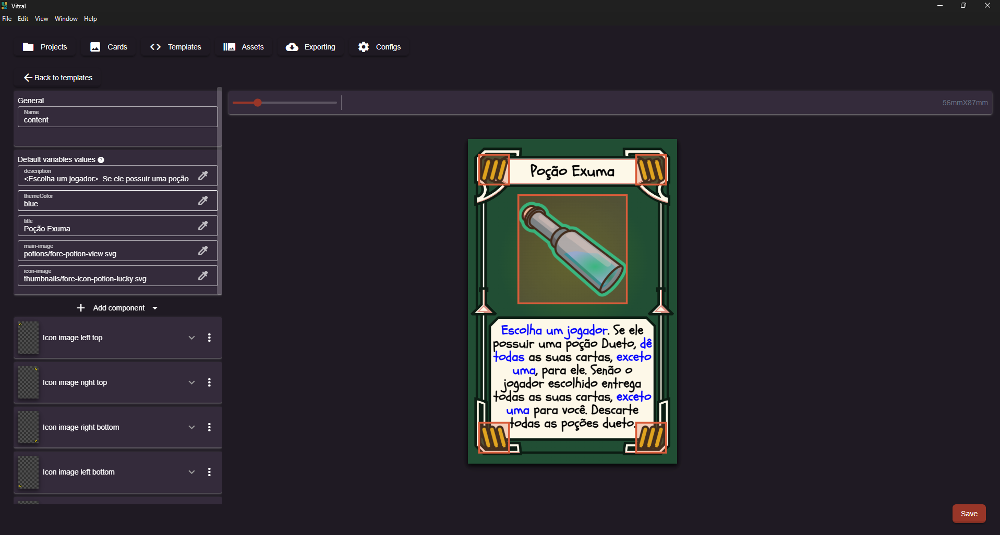
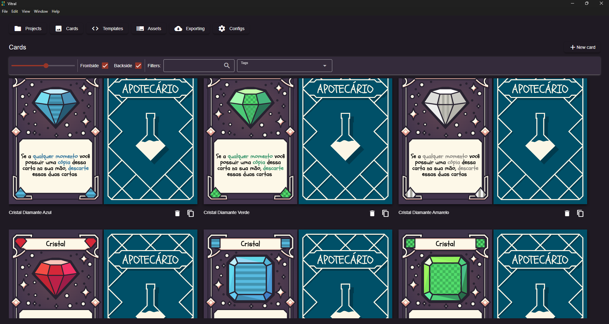
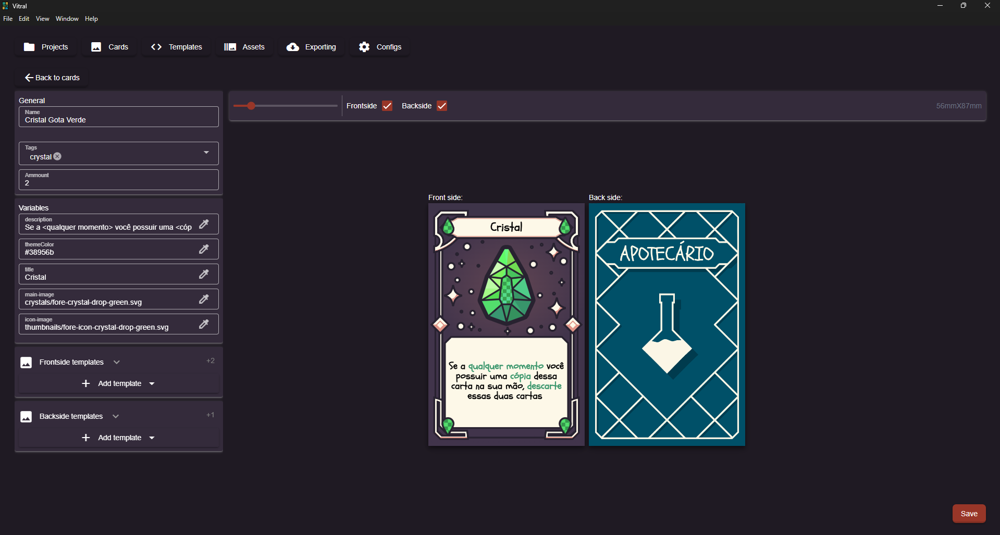

# Vitral Card Game Templating

Prototype and export cards really easy!

## Index

- [About](#about)
- [Downloads](#downloads)
- [Screenshots](#screenshots)
- [Features](#features)
- [How to run the source code](#how-to-run-the-source-code)
- [Contribute](#contribute)


## About

**Vitral** is a tool for composing game cards using images and text.

It doesn't provide image editing tools but instead uses images stored on your computer to automatically generate cards. This allows for fast iterations and live previews.

All files can be updated outside the application using any program, and all data is stored in simple JSON and CSV formats, making it Git-friendly.

This project was created as a way for me to learn Vue.js. I also had a prior tool for composing cards, but it was a mess of JavaScript scripts. This led to the idea of creating a visual tool to improve my workflow, which now serves as a cool project to showcase in interviews. Additionally, it's nice to have an open-source project!

Vitral means stained glass in portuguese. I was inspired by the idea of joining small pieces of art to make a full project.

This project was made using the [electron-vue-template](https://github.com/Deluze/electron-vue-template) boilerplate.

### Downloads

You can download the program through here:

[GitHub Releases](https://github.com/CassianoBelniak/vitral-game-card-templating/releases)

Vitral is available for Windows as an installer or as a portable executable.
Support for Mac and Lixus is only available through source code for now but releases for these platforms is planned.

### Screenshots

These screenshots are from Apotecarios, a game I'm currently developing alongside with Vitral.





### Features

- Supported image formats: PNG, JPEG, WebP, GIF, SVG
- Export options: PNG, JPEG, TIFF, or PDF
- Export individual cards or multiple cards in a single file for fast printing
- Edit your cards visually or directly in the CSV file
- Use templating to compose cards, allowing for reusable components across cards to maintain visual consistency
- Real-time updates: Modify an image in your main tool and see all cards update instantly
- Open source!

## How to run the source code

### Requirements

- Node.js 18.16 or higher is required.

### Development Mode

```bash
npm install # Run once
npm run dev
```

### Build

``` bash
npm install # Run once
npm run build # will build the project using the machine platform
# or
npm run build:linux
npm run build:win
npm run build:mac
```

## Contribute

If you find any bugs or have suggestions, please open an issue. Also, consider leaving a star on the GitHub page — it would mean a lot!
